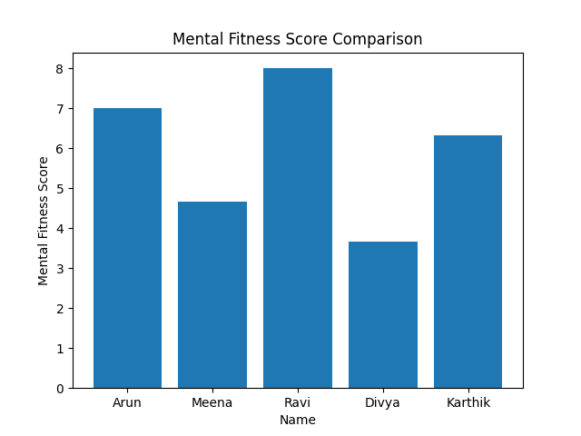

Mental Fitness Tracker 
Project Overview 

This project is a Python-based tool for analyzing data that is meant to keep track of and evaluate mental health. The system figures out a personalized "Mental Fitness Score" by looking at important lifestyle factors like how long you sleep, how stressed you are, and how you feel each day. The goal is to turn subjective feelings into measurable data so that users can see clear, visual trends in their overall mental health. 

Objective 

To combine and visualize data in order to make sense of everyday mental health indicators and come up with useful insights. 

The Key Components of this tool are as follows:

1) Data Handling: The ingestion of the raw lifestyle data (entered by the user in a CSV file) will be managed by the tool. Then, the tool will clean this raw data in preparation for scoring the user's overall mental fitness score (using input information) and calculating averages on the user's mental fitness scores.
2) Score Creation: The tool will calculate the user's overall mental fitness score (based on the user's previous inputted information). 
3) Average Calculation: Averages of user data will be calculated by the tool for all time in order to help each user measure their progress over time.
4) Visualization Creation: All of the various scores of each user will be displayed graphically in clean bar graphs, to aid in understanding.

Built on a foundation of the following technologies:

- Python: the tool was built primarily using Python.
- Pandas: the majority of the tool was built using Pandas for data processing and/or generating visualizations from the data.
- Matplotlib: Matplotlib was used to generate graphical representations of the data.

Output
- Console Result: In the console output, the individual mental fitness scores and their averages will be printed on the screen for the users. 
- Visualization of each user's Mental Fitness Score: Each user's Mental Fitness Score will be displayed on a separate graph.

